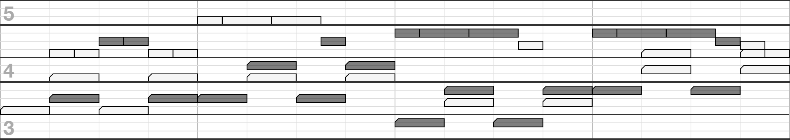

# MIDI to Printable Piano Roll



A tool that converts MIDI files into printable piano rolls. Primarily intended for people who prefer piano rolls found in DAWs over sheet music.

You can use the tool [right here](https://bladeSk.github.io/midi-to-piano-roll). Just drop your local MIDI files, tweak some knobs and print.

## Local usage

Clone this repo, run `npm i` or `yarn` and open index.html in your browser.

## Usage as a Node.js library

`npm i https://github.com/bladeSk/midi-to-piano-roll`

```
const fs = require('fs')
const PianoRollSvg = require('midi-to-piano-roll')

let midi = fs.readFileSync('test.mid', { encoding: 'base64' })
let prSvg = new PianoRollSvg(midi)

// get all the available config options here: PianoRollSvg.getDefaultConfig()
let svg = prSvg.render({
	tracksToRender: { 0: true, 2: true, 3: true },
})

fs.writeFileSync('test.svg', svg)
```